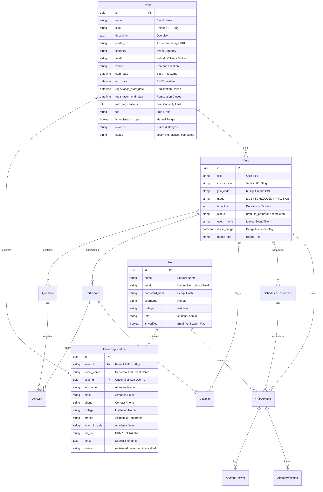

# System Architecture & Technical Design Document (Detailed Specification)

**Project Name**: Microsoft Student Club (MSC PRPCEM) — Real-Time Live & Scheduled Quiz Assessment Platform  
**System Version**: 2.3.1 (Release v1.8.2)  
**Document Classification**: Engineering Architecture & Technical Design Specification  
**Primary Maintainer**: Microsoft Student Club Technical Architecture Team  
**Target Environments**: Node.js 18+ LTS, React 18+ (Vite), Sequelize ORM 6+, Socket.io 4+, Azure Blob Storage, SQLite 3 (Dev/Local) & Neon Serverless PostgreSQL 15/16+ (Production)

---

## Table of Contents
1. [Executive Summary & Core Architectural Tenets](#1-executive-summary--core-architectural-tenets)
2. [System Context & Domain Model](#2-system-context--domain-model)
3. [Codebase & Module Topology](#3-codebase--module-topology)
4. [High-Level Architecture & Multi-Tier Topology](#4-high-level-architecture--multi-tier-topology)
5. [Core Subsystems & Technical Workflow Specifications](#5-core-subsystems--technical-workflow-specifications)
   - 5.1 [Real-Time Socket.io Live Quiz Engine](#51-real-time-socketio-live-quiz-engine)
   - 5.2 [Scheduled Self-Paced Exam & Assessment Engine](#52-scheduled-self-paced-exam--assessment-engine)
   - 5.3 [Anti-Cheating, Proctoring & Violation Detection Subsystem](#53-anti-cheating-proctoring--violation-detection-subsystem)
   - 5.4 [Branded QR Code Generation & Card Download Subsystem](#54-branded-qr-code-generation--card-download-subsystem)
   - 5.5 [Digital Badge, Certificate & Credential Issuance Engine](#55-digital-badge-certificate--credential-issuance-engine)
   - 5.6 [Vanity Slug & Intelligent Direct Routing Engine](#56-vanity-slug--intelligent-direct-routing-engine)
   - 5.7 [Flagship Event Management & Dynamic Expiration Engine](#57-flagship-event-management--dynamic-expiration-engine)
   - 5.8 [Targeted Email Dispatch & Broadcast Subsystem](#58-targeted-email-dispatch--broadcast-subsystem)
   - 5.9 [Centralized SSO & OAuth 2.0 / OpenID Connect Provider](#59-centralized-sso--oauth-20--openid-connect-provider)
   - 5.10 [Multi-Format Question Bank & Excel Ingestion Pipeline](#510-multi-format-question-bank--excel-ingestion-pipeline)
   - 5.11 [Azure Blob Storage & Asset Management Pipeline](#511-azure-blob-storage--asset-management-pipeline)
   - 5.12 [Body Portal Modal Architecture & Background Scroll-Lock Subsystem](#512-body-portal-modal-architecture--background-scroll-lock-subsystem)
   - 5.13 [Public Open-Source Distribution & Automated Sync Sanitization](#513-public-open-source-distribution--automated-sync-sanitization)
6. [Exhaustive Database Architecture & Data Dictionary](#6-exhaustive-database-architecture--data-dictionary)
   - 6.1 [Entity-Relationship Diagram (ERD)](#61-entity-relationship-diagram-erd)
   - 6.2 [Data Dictionary & Model Specifications](#62-data-dictionary--model-specifications)
7. [Comprehensive REST API & WebSocket Event Specification](#7-comprehensive-rest-api--websocket-event-specification)
   - 7.1 [RESTful API Endpoints](#71-restful-api-endpoints)
   - 7.2 [Socket.io Event Contracts (Client & Server)](#72-socketio-event-contracts-client--server)
8. [Client-Side UX & Performance Engineering](#8-client-side-ux--performance-engineering)
9. [Security Architecture & Threat Modeling](#9-security-architecture--threat-modeling)
10. [Reliability, Resilience & State Recovery](#10-reliability-resilience--state-recovery)
11. [Deployment, Infrastructure & Configuration Blueprint](#11-deployment-infrastructure--configuration-blueprint)

---

## 1. Executive Summary & Core Architectural Tenets

The **MSC PRPCEM Quiz & Assessment Platform** is an enterprise-grade testing and event operations ecosystem engineered to support:
1. **High-concurrency live multiplayer quiz competitions** with sub-50ms WebSocket latency.
2. **Formal scheduled proctored certifications** with automated timer evaluation and answer persistence.
3. **Official Microsoft Student Club branded QR card generation** with center logo excavation and dynamic vanity short-links.
4. **Automated digital credentials & certificates** with verifiable serial keys and PDF/PNG downloads.
5. **Flagship event registration management** with deadline countdowns, seat capacity constraints, and automatic lifecycle archival.
6. **Targeted email broadcasts** with dynamic placeholder merge tags and SMTP delivery.
7. **Centralized Single Sign-On (SSO / OIDC)** bridging student authentication across all MSC web properties.

```
┌────────────────────────────────────────────────────────────────────────────────────────────────────────┐
│                                       CORE ARCHITECTURAL TENETS                                        │
├────────────────────┬────────────────────┬───────────────────────┬───────────────────┬──────────────────┤
│ 1. Sub-50ms Sync   │ 2. Zero-Loss       │ 3. Automated          │ 4. Deterministic  │ 5. Unified Brand │
│    Live State      │    Proctoring      │    Event Lifecycle    │    Scoring Engine │    Integrity     │
│ WebSocket rooms    │ Client blur, tab   │ Events automatically  │ Speed + accuracy  │ High-DPI canvas  │
│ broadcast timers   │ switches, and      │ archive to completed  │ formula calculates│ cards, center    │
│ and answers with   │ fullscreen loss    │ when dates pass;      │ leaderboard rank  │ logos, & official│
│ sub-50ms latency   │ logged in real-time│ capacity locks seats  │ in real time      │ chapter styling  │
└────────────────────┴────────────────────┴───────────────────────┴───────────────────┴──────────────────┘
```

---

## 2. System Context & Domain Model

### 2.1. System Actors
1. **Contestant / Student**: Joins live quiz rooms via 6-digit PINs, scans branded QR cards, attempts scheduled exams, registers for flagship technical events, tracks leaderboard rankings, and claims digital badges.
2. **Quiz Master / Admin**: Authors questions, controls live quiz question advancement, manages technical events and attendee rosters, broadcasts targeted emails, schedules recurring/one-time exam time windows, and downloads marketing QR cards.
3. **Automated Proctor Agent**: Client-side monitoring hooks capturing tab switches, clipboard attempts, window blur events, and fullscreen exits.
4. **MSC Ecosystem Services**: External consumers of the platform's OpenID Connect SSO and public event feeds.

### 2.2. Operating Modes
- **Mode A: Real-Time Live Quiz (Host-Driven)**: Synchronized lobby via PIN code; admin triggers question transitions; scoring incorporates speed decay bonuses.
- **Mode B: Scheduled Self-Paced Exam (Candidate-Driven)**: Independent countdown timer within active window (`valid_from` to `valid_until`), randomized question order, answer persistence on selection.
- **Mode C: Public Event Registration Gateway**: Public landing pages (`/register/:slug`) with capacity caps, registration deadlines, and instant confirmation dispatch.
- **Mode D: Certificate & Digital Badge Verification**: Public validation endpoints checking candidate authenticity, score integrity, and chapter accreditation.

---

## 3. Codebase & Module Topology

```
Quiz-platform/
├── backend/
│   ├── src/
│   │   ├── config/
│   │   │   └── database.js            # Sequelize database connection & dialect config
│   │   ├── middleware/
│   │   │   └── auth.js                # Centralized JWT verification & session guards
│   │   ├── models/
│   │   │   ├── Admin.js               # Admin credentials & role flags
│   │   │   ├── Answer.js              # Live quiz participant answer submissions
│   │   │   ├── AttemptAnswer.js       # Scheduled quiz candidate answer selections
│   │   │   ├── AttemptViolation.js    # Scheduled quiz proctoring violation logs
│   │   │   ├── Event.js               # Flagship event metadata, dates, capacity & fees
│   │   │   ├── EventRegistration.js   # Student event registrations & participant PII
│   │   │   ├── Participant.js         # Live quiz participant records & scores
│   │   │   ├── Question.js            # Question bank (MCQ, Multi-select, Code, Media)
│   │   │   ├── Quiz.js                # Quiz parent metadata, mode, PIN, timer settings
│   │   │   ├── QuizAttempt.js         # Scheduled quiz attempt instance & final score
│   │   │   ├── ScheduledOccurrence.js # Time-window occurrence schedule
│   │   │   ├── User.js                # Synchronized student accounts & credentials
│   │   │   ├── Violation.js           # Live quiz proctoring violation events
│   │   │   └── index.js               # Model relationships & foreign key mappings
│   │   ├── routes/
│   │   │   ├── analytics.js           # Quiz metrics, question difficulty, export
│   │   │   ├── auth.js                # Admin authentication & token verification
│   │   │   ├── branding.js            # Dynamic chapter themes, club logos, color tokens
│   │   │   ├── emailDispatch.js       # Targeted mass email broadcasting & templating
│   │   │   ├── eventsApi.js           # Event lifecycle, attendee registrations, quiz linkage & delinkage
│   │   │   ├── export.js              # CSV and Excel export generators
│   │   │   ├── quiz.js                # Synchronized Live Quiz operations
│   │   │   ├── scheduledQuiz.js       # Asynchronous Scheduled Quiz operations
│   │   │   ├── sso.js                 # OAuth 2.0 / OpenID Connect Identity Provider
│   │   │   ├── studentSync.js         # Student authentication, OTPs & certificates
│   │   │   └── userDirectory.js       # Student directory, verification toggles, bulk actions & sample seeding
│   │   ├── services/
│   │   │   ├── azureBlobService.js    # Azure Blob Storage integration for poster uploads
│   │   │   ├── emailService.js        # Nodemailer SMTP transport & cryptographic OTPs
│   │   │   └── socket.js              # Socket.io real-time live game & timer engine
│   │   └── server.js                  # Express app, HTTP server, and Socket.io init
│   └── package.json
│
├── frontend/
│   ├── src/
│   │   ├── components/
│   │   │   ├── AdminLayout.jsx        # Unified administrative sidebar & topbar
│   │   │   ├── DigitalBadgeCard.jsx   # Credential certificate card with sharing & download
│   │   │   ├── EventSelector.jsx      # Reusable event attachment dropdown & quick create modal
│   │   │   ├── Navbar.jsx             # Responsive mobile drawer & student chip
│   │   │   ├── Footer.jsx             # Legal links & 2-column mobile footer
│   │   │   ├── QRScanner.jsx          # Camera-based HTML5 QR code reader
│   │   │   ├── ThemeDropdown.jsx      # 100% opaque theme dropdown selector with elevated shadow
│   │   │   └── Timer.jsx              # Circular SVG countdown timer
│   │   ├── context/
│   │   │   ├── AuthContext.jsx        # Centralized student & admin authentication
│   │   │   ├── SocketContext.jsx      # Centralized Socket.io client instance
│   │   │   └── ToastContext.jsx       # Global notification toasts
│   │   ├── pages/
│   │   │   ├── AdminDashboard.jsx     # Master admin control center
│   │   │   ├── AdminEmailDispatch.jsx # Mass email broadcaster interface
│   │   │   ├── AdminEvents.jsx        # Flagship event CRUD & attendee tables
│   │   │   ├── AdminScheduledQuizzes.jsx # Scheduled exams manager with quick QR modal
│   │   │   ├── AdminUsers.jsx         # User directory & role oversight
│   │   │   ├── CreateScheduledQuiz.jsx# Scheduled quiz creation wizard with live preview
│   │   │   ├── EventRegister.jsx      # Public event registration page with timer
│   │   │   ├── Home.jsx               # Landing page with join code entry & catalog
│   │   │   ├── JoinQuiz.jsx           # Student pin/slug entrance & authentication
│   │   │   ├── LiveQuiz.jsx           # Real-time contestant gameplay screen
│   │   │   ├── QuestionManagement.jsx # Question builder (Options, Points, Media)
│   │   │   ├── QuizManagement.jsx     # Live Quiz catalog & host controls
│   │   │   ├── Results.jsx            # Live podium & scorecard rankings
│   │   │   ├── RunQuiz.jsx            # Admin live host control dashboard & lobby QR
│   │   │   ├── ScheduledQuizDetails.jsx # Scheduled quiz occurrences & candidate results
│   │   │   ├── ScheduledQuizTake.jsx  # Candidate test-taking proctored environment
│   │   │   ├── StudentAuth.jsx        # Student portal login & registration
│   │   │   └── VanityRedirect.jsx     # Short vanity link resolver (/q/:slug)
│   │   ├── utils/
│   │   │   ├── dateUtils.js           # IST timezone normalization & date formatting
│   │   │   ├── pkce.js                # Cryptographic PKCE challenge generator
│   │   │   └── qrCardGenerator.js     # Unified Branded QR Card Canvas renderer & downloader
│   │   ├── services/
│   │   │   └── api.js                 # Axios client with JWT interceptors
│   │   ├── App.jsx                    # Route switchboard & layout wrappers
│   │   └── index.css                  # Tailwind CSS, Fluent design tokens & responsive rules
│   └── package.json
│
├── report.md                          # Full security vulnerability audit & remediation scorecard
├── DESIGN.md                          # This architecture specification document
└── README.md                          # Project documentation & quickstart guide
```

---

## 4. High-Level Architecture & Multi-Tier Topology

```mermaid
graph TB
    subgraph Tier1["Tier 1: Client Layer (React 18 + Vite SPA)"]
        LiveContestant["Live Contestant SPA (Socket.io Client)"]
        ScheduledCandidate["Exam Candidate SPA (REST API Client)"]
        EventAttendee["Event Registration Portal (/register/:slug)"]
        AdminHost["Admin Portal (Events, Quizzes, Dispatch, Directory)"]
        QRCardPipeline["Branded QR Canvas Pipeline (qrCardGenerator.js)"]
        ProctorHook["Client Proctoring Agent (Blur / Tab Listeners)"]
    end

    subgraph Tier2["Tier 2: Gateway & Real-Time Transport (Node.js Express)"]
        ExpressGW["Express.js HTTP REST API"]
        SocketEngine["Socket.io WebSocket Server (Rooms, Broadcasts)"]
        AuthGuard["JWT authMiddleware & Rate Limiters"]
        ExpressGW --> AuthGuard
    end

    subgraph Tier3["Tier 3: Core Domain Services"]
        GameManager["Live Game Session State (activeQuizzes)"]
        TimerService["Server-Authoritative Clock & Countdown Timers"]
        ScoreEngine["Scoring Engine (Speed Decay + Accuracy)"]
        ExamManager["Scheduled Exam State Manager"]
        BrandingEngine["Dynamic Chapter Branding Engine (/api/branding)"]
        EmailService["Nodemailer SMTP Broadcast & OTP Engine"]
        AzureBlob["Azure Blob Storage Service (Poster Assets)"]
        BadgeEngine["Digital Credential & Certificate Engine"]
        SSOProvider["OAuth 2.0 / OIDC Authorization Server"]
    end

    subgraph Tier4["Tier 4: Relational Persistence Layer (Neon Serverless Postgres)"]
        SequelizeORM["Sequelize ORM Engine (Auto-Migrations)"]
        Database[("Neon Serverless Postgres (PgBouncer Pooled)")]
        SequelizeORM --> Database
    end

    LiveContestant <==>|WebSocket WSS| SocketEngine
    AdminHost <==>|WebSocket WSS| SocketEngine
    AdminHost ==>|HTTPS REST Bearer JWT| ExpressGW
    ScheduledCandidate ==>|HTTPS REST| ExpressGW
    EventAttendee ==>|HTTPS REST| ExpressGW
    ProctorHook -.->|Violation Telemetry| ExpressGW
    QRCardPipeline -.->|Fetch Remote Branding| BrandingEngine

    SocketEngine <--> GameManager
    SocketEngine <--> TimerService
    SocketEngine <--> ScoreEngine
    ExpressGW --> ExamManager
    ExpressGW --> BrandingEngine
    ExpressGW --> EmailService
    ExpressGW --> AzureBlob
    ExpressGW --> BadgeEngine
    ExpressGW --> SSOProvider

    GameManager --> SequelizeORM
    ExamManager --> SequelizeORM
    EmailService --> SequelizeORM
    SSOProvider --> SequelizeORM
```



---

## 5. Core Subsystems & Technical Workflow Specifications

### 5.1. Real-Time Socket.io Live Quiz Engine
- Synchronized lobby via 6-digit PIN code.
- State-machine lifecycle: `LOBBY` → `QUESTION_ACTIVE` → `QUESTION_CLOSED` → `LEADERBOARD` → `COMPLETED`.
- Admin triggers question transitions (`question_open`, `timer_tick`, `question_close`, `show_leaderboard`).
- Scoring incorporates time-decay bonuses:
  $$\text{Score} = \text{BasePoints} \times \left( \frac{\text{TimeRemaining}}{\text{TotalTime}} \right) + \text{StreakBonus}$$

### 5.2. Scheduled Self-Paced Exam & Assessment Engine
- Candidate takes an individual attempt within an active time window (`valid_from` to `valid_until`).
- Independent countdown timer, randomized question order, answer persistence on every selection via `POST /api/scheduled-quizzes/attempts/:attemptId/answer`.
- Automatic submission upon timer expiry with proctoring violation summary.

### 5.3. Anti-Cheating, Proctoring & Violation Detection Subsystem
- Fullscreen lockdown (`document.fullscreenElement`), tab-switch listeners (`visibilitychange`), and window blur tracking (`window.onblur`).
- Violation event logging persisted to `AttemptViolations` table with timestamps and contextual reason strings.
- Configurable violation thresholds triggering automated disqualification or penalty deductions.

### 5.4. Branded QR Code Generation & Card Download Subsystem
The platform features a unified, high-DPI canvas generator ([`qrCardGenerator.js`](file:///c:/Quiz-platform/frontend/src/utils/qrCardGenerator.js)) used across all quiz surfaces (Live Quizzes, Scheduled Quizzes, Admin Dashboard, and Creation Wizards):

```
┌────────────────────────────────────────────────────────┐
│ [══════════════════ Primary Gradient Accent ══════════]│
│                                                        │
│                       (🛡️ Logo)                        │
│                 MICROSOFT STUDENT CLUB                 │
│                   MSC-PRPCEM CHAPTER                   │
│ ────────────────────────────────────────────────────── │
│                                                        │
│             AZURE CLOUD & AI ASSESSMENT                │
│          CLOUD & AZURE • WEEKLY ASSESSMENT             │
│                                                        │
│          ┌──────────────────────────────────┐          │
│          │         ▄▄▄▄▄      ▄▄▄▄▄         │          │
│          │         █ ▄ █  ██  █ ▄ █         │          │
│          │         █   █  (🛡️) █   █         │          │
│          │         █▄▄▄█  ██  █▄▄▄█         │          │
│          └──────────────────────────────────┘          │
│                                                        │
│               Scan with camera or visit:               │
│         https://quiz.mscprpcem.tech/join/582910        │
│                                                        │
│          ┌──────────────────────────────────┐          │
│          │        UNIQUE JOIN CODE          │          │
│          │             582910               │          │
│          └──────────────────────────────────┘          │
│                                                        │
│     Powered by Microsoft Student Club Quiz Platform    │
│ [══════════════════ Bottom Accent Line ═══════════════]│
└────────────────────────────────────────────────────────┘
```

- **Canvas Dimensions**: 400 × 650 px (renderable at 2x high-resolution scale).
- **Center Logo Excavation**: Uses `level="H"` Reed-Solomon error correction on `<QRCodeSVG>` with `excavate: true` to carve out space for the circular MSC-PRPCEM badge without compromising QR decodability.
- **Dynamic De-Duplication**: Prevents repeated strings if `club_name` and `chapter_name` both contain chapter identifiers (e.g. formatting line 1 as `MICROSOFT STUDENT CLUB` and line 2 as `MSC-PRPCEM CHAPTER`).
- **Dynamic Font Autoscaling**: Ensures long vanity codes or multi-word slugs cleanly fit the 240px wide access code box without text truncation.
- **Universal Access URLs**: Encodes `https://quiz.mscprpcem.tech/join/{join_code}` which seamlessly routes both mobile scanners and desktop visitors into active sessions.

### 5.5. Digital Badge, Certificate & Credential Issuance Engine
- Evaluates candidate completion criteria upon test submission (e.g., score $\ge 70\%$, total time $\le$ limit, zero major proctoring disqualifications).
- Generates cryptographically verifiable credential payloads with:
  - Serialized Badge ID (e.g., `MSC-CERT-2026-XXXX`)
  - Recipient Full Name & PRN Roll Number
  - Chapter Accreditation Authority (`signing_authority`)
  - Timestamp & Verification URL
- Rendered on-client via [`DigitalBadgeCard.jsx`](file:///c:/Quiz-platform/frontend/src/components/DigitalBadgeCard.jsx) with 3D tilt effects, printable PDF export, and PNG image download.

### 5.6. Vanity Slug & Intelligent Direct Routing Engine
- Handles short URLs such as `/q/:slug`, `/quiz/:slug`, and `/join/:code`.
- Implemented via [`VanityRedirect.jsx`](file:///c:/Quiz-platform/frontend/src/pages/VanityRedirect.jsx) and backend route `/api/scheduled-quizzes/slug/:slug`.
- Resolves:
  1. Active Scheduled Quiz Occurrences
  2. Live Quiz Rooms
  3. Linked Flagship Event Tracks

### 5.7. Flagship Event Management & Dynamic Expiration Engine
- Full event lifecycle management supporting start/end datetimes, registration deadlines, and seat capacity.
- Automatic status evaluation: if `new Date(event.end_date || event.start_date) < new Date()`, the event automatically moves to **Completed / Past Events** and closes registrations.
- Public registration endpoint (`POST /api/events/register`) automatically syncs attendees into matching live and scheduled quiz tracks.
- **Event-Quiz Linkage & Delinking Architecture**:
  - Links live and scheduled quizzes to technical events (`POST /api/events/:id/link-quiz`), setting `event_id` and `event_name`.
  - **Decoupled Card Surface**: Removed cluttered in-card quiz links and scheduled test buttons. Quiz management and delinking are encapsulated inside the dedicated Event Management modal (`POST /api/events/:id/delink-quiz`) with safety confirmations.
  - **Cascading Attendee Purge**: Deleting an event registration record automatically cascades across associated `QuizAttempt` and `Participant` rows, ensuring zero ghost attendee data lingers in event leaderboards or mailing audiences.

### 5.8. Targeted Email Dispatch & Broadcast Subsystem
- Mass email delivery powered by Nodemailer SMTP transport.
- Dynamic placeholder replacement engine:
  - `{name}` → Recipient student name
  - `{college}` → Student institution
  - `{branch}` → Academic department
  - `{phone}` → Contact phone number
  - `{quiz_title}` → Associated challenge title
  - `{join_code}` → 6-character room PIN
  - `{score}` → Participant test score
- **Unified Institutional Live Email Preview Engine**:
  - 1:1 layout match with backend `emailService.js` `renderHtmlWrapper`: deep navy `#0f172a` banner, 3px brand blue `#2563eb` accent rule, pill badge `MICROSOFT STUDENT CLUB • PRPCEM`, elevated CTA action button with drop shadow, and official chapter footer.
  - **Responsive Dual-Viewport Simulator**: Interactive toggle between **Desktop View (580px)** and **Mobile View (375px phone chassis)** with realistic smartphone framing and scroll containers.
  - **Smart Greeting Deduplication**: Dynamically inspects custom template content and omits prepending `"Hello {name},"` if the author already provided an opening greeting.
  - **Audience Cascading Sanitation**: Strict recipient resolution prevents ghost attempt injections and eliminated arbitrary database fallbacks, ensuring mailings strictly mirror active registrations.

### 5.9. Centralized SSO & OAuth 2.0 / OpenID Connect Provider
- Authorization code grant flow with cryptographic PKCE verification (`code_challenge` / `code_verifier`).
- Cookie-based session tracking and `/oauth/userinfo` OpenID profile endpoint.

### 5.10. Multi-Format Question Bank & Excel Ingestion Pipeline
- Supports multiple question paradigms:
  - Single-Choice Multiple Choice (MCQ)
  - Multi-Select Multiple Correct Choices (`MULTI_SELECT`)
  - Code Snippet Analysis (Syntax highlighted blocks)
  - True / False Boolean evaluations
- **Excel Spreadsheet Import**: Parses `.xlsx` / `.xls` spreadsheets via SheetJS (`xlsx`), validating required columns (`Question`, `Option A`, `Option B`, `Option C`, `Option D`, `Correct Answer`, `Points`, `Time Limit`), and previewing parsed questions in an interactive review modal before bulk insertion.

### 5.11. Azure Blob Storage & Asset Management Pipeline
- Integrates `@azure/storage-blob` for event posters, quiz media banners, and digital badge graphics.
- Generates cryptographically unique blob filenames with sanitized content-type headers and CORS-enabled Azure CDN endpoints.

### 5.12. Body Portal Modal Architecture & Background Scroll-Lock Subsystem
- **Root Cause Problem**: In administrative layouts featuring nested scrollable viewports (`<main className="flex-1 overflow-y-auto">`), traditional `fixed inset-0` dialogs cause browsers to reset container `scrollTop` to 0 upon mounting, causing disorienting viewport jumps to the top of the page.
- **Architectural Solution**:
  1. **React Body Portals**: All administrative modals across User Directory (`AdminUsers.jsx`), Event Selector (`EventSelector.jsx`), Scheduled Quizzes (`AdminScheduledQuizzes.jsx`), Email Broadcaster (`AdminEmailDispatch.jsx`), and Event Management (`AdminEvents.jsx`) are mounted into `document.body` via `createPortal(..., document.body)` at `z-[10000]`.
  2. **Active Viewport Centering**: Modals position directly within the administrator's current viewport using `fixed inset-0 flex items-center justify-center p-4 bg-slate-950/60 backdrop-blur-sm`.
  3. **Dual-Layer Scroll Lock**: A coordinated `useEffect` hook simultaneously locks `document.body.style.overflow = 'hidden'` and `<main>.style.overflow = 'hidden'`, intercepting `wheel` and `touchmove` events with propagation barriers.
  4. **Preserved Table Scroll Coordinates**: Administrative actions (such as verification toggles or detail inspections) trigger silent background updates (`fetchUsers(true)`), preventing DOM destruction and maintaining scroll position.

### 5.13. Public Open-Source Distribution & Automated Sync Sanitization
- **Repository Separation**:
  - `mscprpcem/Quiz-platform`: Internal production repository connected to Azure Static Web Apps (Frontend) and Azure App Service (Backend API).
  - `mscprpcem/Quiz-Platform-MSCPRPCEM`: Public open-source mirror repository shared with students and external community contributors.
- **Automated Workflow Sanitization Pipeline** ([`.github/workflows/repo-sync.yml`](file:///c:/Quiz-platform/.github/workflows/repo-sync.yml)):
  1. **Branch Isolation**: The synchronization job checks out `main` and creates an isolated release branch (`public-sync-release`).
  2. **Workflow Stripping**: Strips `.github/workflows/` (removing Azure deployment pipelines and internal sync triggers) so that the public open-source mirror repository never executes failing CI/CD builds or triggers missing-secret alerts.
  3. **Graceful Secret Handling**: Checks for `SYNC_PAT`. If not configured, it emits an informative GitHub notice and exits with `exit 0` to preserve green status checks across all commits.
  4. **Force Mirroring**: Pushes the sanitized release branch to `Quiz-Platform-MSCPRPCEM.git` (`main:main --force`), keeping the open-source community up-to-date with complete application features.

---

## 6. Exhaustive Database Architecture & Data Dictionary

### 6.1. Entity-Relationship Diagram (ERD)



---

## 7. Comprehensive REST API & WebSocket Event Specification

### 7.1. RESTful API Endpoints Summary

| Group | Route | Method | Auth | Description |
| :--- | :--- | :---: | :---: | :--- |
| **Auth** | `/api/auth/login` | POST | Public (Rate Limited) | Admin login with JWT issue |
| **Auth** | `/api/auth/verify` | GET | Bearer JWT | Current admin session verification |
| **Branding** | `/api/branding` | GET | Public | Official chapter branding, colors, & logo tokens |
| **Live Quizzes** | `/api/quizzes` | GET | Bearer JWT | Live Quiz catalog (`mode=LIVE`) |
| **Live Quizzes** | `/api/quizzes` | POST | Bearer JWT | Create Live Quiz session |
| **Live Quizzes** | `/api/quizzes/public` | GET | Public | Public sanitized live quizzes |
| **Scheduled Quizzes**| `/api/scheduled-quizzes` | GET/POST | Bearer JWT | Scheduled quiz manager & creator |
| **Scheduled Quizzes**| `/api/scheduled-quizzes/:id` | GET | Bearer JWT | Scheduled quiz details, occurrences, & attempts |
| **Scheduled Quizzes**| `/api/scheduled-quizzes/slug/:slug` | GET | Public | Resolve custom vanity slug or join code |
| **Scheduled Quizzes**| `/api/scheduled-quizzes/occurrences/:id` | GET | Public | Question sheet (answers stripped) |
| **Scheduled Quizzes**| `/api/scheduled-quizzes/attempts/:attemptId/answer` | POST | Public/JWT | Persist candidate answer selection |
| **Events** | `/api/events` | GET | Public | Flagship events catalog |
| **Events** | `/api/events` | POST | Bearer JWT | Create new technical event |
| **Events** | `/api/events/:id` | PUT/DELETE | Bearer JWT | Update/delete technical event |
| **Events** | `/api/events/:id/link-quiz` | POST | Bearer JWT | Link live/scheduled quiz to event |
| **Events** | `/api/events/:id/delink-quiz` | POST | Bearer JWT | Safely delink quiz from event |
| **Events** | `/api/events/:id/registrations` | GET | Bearer JWT | Attendee PII & contact list |
| **Events** | `/api/events/upload-poster` | POST | Bearer JWT | Upload image to Azure Blob Storage |
| **Events** | `/api/events/register` | POST | Public | Attendee event registration |
| **Email Dispatch** | `/api/admin/email-dispatch/send` | POST | Bearer JWT | Targeted broadcast dispatch |
| **User Directory** | `/api/admin/users` | GET | Bearer JWT | Paginated student user directory |
| **User Directory** | `/api/admin/users/:id` | DELETE | Bearer JWT | Cascading single student deletion |
| **User Directory** | `/api/admin/users/bulk-delete` | POST | Bearer JWT | Cascading bulk student deletion |
| **User Directory** | `/api/users-directory/:id/verify` | PATCH | Bearer JWT | Confirmed student verification toggle |
| **User Directory** | `/api/users-directory/bulk-verify` | POST | Bearer JWT | Bulk student verification / revocation |
| **User Directory** | `/api/admin/users/seed-samples` | POST | Bearer JWT | Demo student account seeding |
| **Analytics** | `/api/analytics/public/leaderboard` | GET | Public | Public top-10 leaderboard |
| **SSO** | `/oauth/userinfo` | GET | Bearer Token | OpenID Connect profile |

---

## 8. Client-Side UX & Performance Engineering

- **Mobile First Responsive Design**: Fluid typography (`clamp()`), safe-area padding for notches, and minimum 44px touch targets.
- **Body Portal Modal Geometry**: All administrative dialogs rendered via `createPortal(..., document.body)` with `z-[10000]`, backdrop blur, and dual-layer background scroll lock on both `document.body` and `<main>` containers, preventing page jumps and scroll bleed.
- **100% Solid Opaque Theme Selectors**: `ThemeDropdown.jsx` eliminates background bleed-through with 100% solid white geometry, elevated shadows (`shadow-2xl shadow-slate-900/20`), and active check indicators across both light and dark themes.
- **Responsive Email Preview Chassis**: Embedded desktop (580px) and smartphone (375px) device viewport switcher for live visual validation of broadcast emails before dispatch.
- **Top 3 Podium Architecture**: Responsive Gold (#1 on top), Silver (#2), and Bronze (#3) leaderboard layout with particle animations.
- **High-DPI QR Card Rendering**: Pure HTML5 Canvas pipeline producing crisp 400×650 PNG cards with brand colors and center logo excavation.
- **Vite Bundle Optimization**: Vendor chunk splitting for React, Socket.io, Lucide icons, SheetJS, and QRCode generators.

---

## 9. Security Architecture & Threat Modeling

- **100% Remediated Scorecard**: All 31 audited vulnerabilities, architectural bottlenecks, and UX bugs patched and verified in `report.md`.
- **Destructive Action Confirmation Guardrails**: Critical verification revocations and bulk un-verifications protected by explicit modal challenges to prevent accidental loss of verified student access.
- **Cascading Deletion Hygiene**: Removal of attendees and student accounts cascades across `QuizAttempt`, `Participant`, and `Subscriber` records, preventing ghost data accumulation in email broadcasts.
- **Strict Authorization**: `authMiddleware` guards all admin-facing endpoints.
- **Sanitized Payloads**: Plaintext answers stripped from all public endpoints.
- **Brute-Force Throttling**: 10 requests per 15-minute window on auth and OTP routes.
- **Cryptographic Security**: Node.js `crypto` used for all OTPs and random join codes.
- **CI/CD Sync Isolation**: Cross-repository sync strips production deployment workflows, preventing credential leaks and spurious build failures on public mirrors.

---

## 10. Reliability, Resilience & State Recovery

- **WebSocket Reconnection Protocol**: Automatic resume token allowing students to reconnect to live question rounds without losing score state.
- **Database Connection Pooling**: Tuned connection pool (`max: 40`) with automated SQLite/PostgreSQL schema migration.

---

## 11. Deployment, Infrastructure & Configuration Blueprint

- **Environment Variables**:
  - `PORT`: Server listening port (default: 5000)
  - `AZURE_STORAGE_CONNECTION_STRING`: Azure Blob Storage credentials
  - `AZURE_BRANDING_URL`: Dynamic remote chapter branding JSON URL
  - `JWT_SECRET`: Cryptographic token signing key
  - `SMTP_HOST`, `SMTP_PORT`, `SMTP_USER`, `SMTP_PASS`: SMTP email delivery configuration
